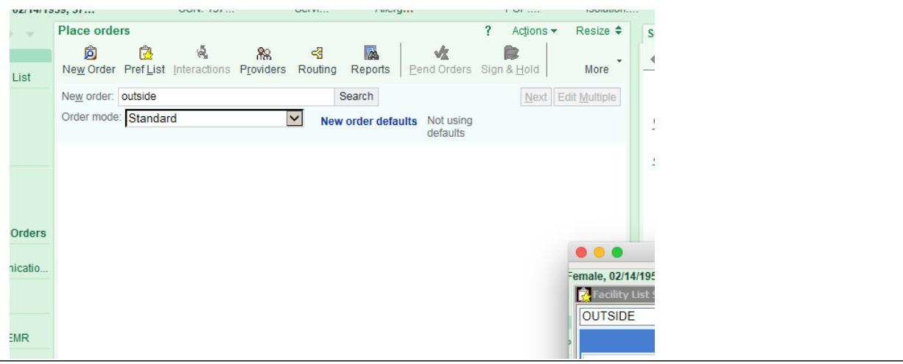
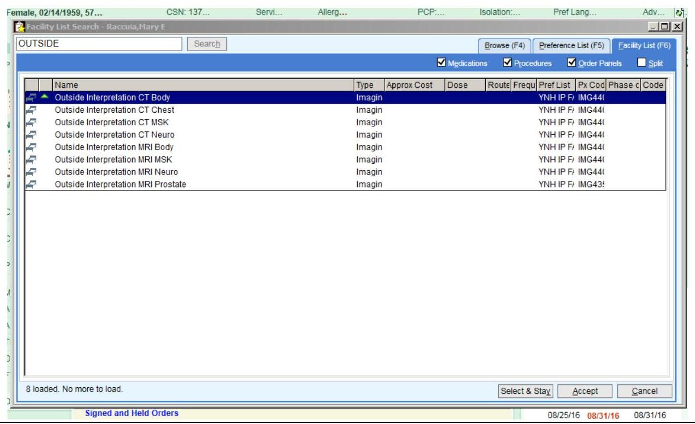
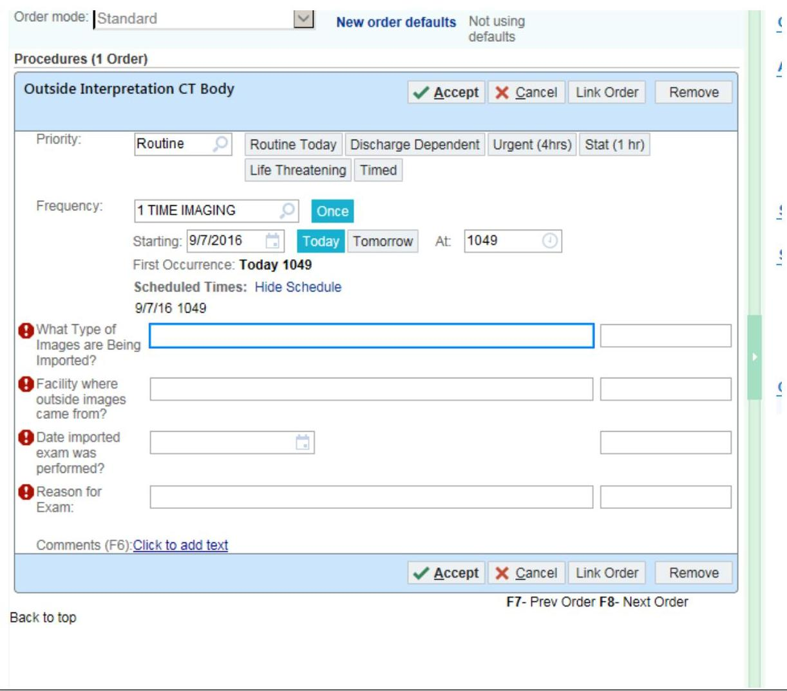

# How to place an order for an outside read on studies already loaded into PACS from an outside hospital: 

1. Open patient's folder in EPIC.
2. Open orders.
3. Search for orders containing the word 'outside':

4. Select the correct outside study type ONLY from the list shown:

5. Complete the clinical details requested and 'accept'. If no clinical reasons for the exam are entered, the request may be refused at the discretion of the radiologist.
