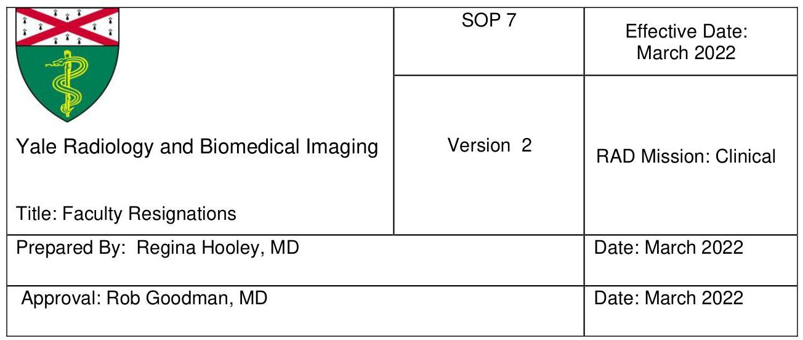

# A. Purpose 

The purpose of this Standard Operating Procedure (SOP) is to describe the policy for YDR faculty who have informed YDR that they will be leaving Yale.

## B. Scope

As above

## C. Procedures

1. Faculty who are leaving YDR are expected to continue to work at YDR as per the terms of their offer letter.
2. Electronic devices
a. Personal computers and tablets purchased by faculty staff accounts should be returned to YDR. Faculty may elect to keep these devices, but are required to purchase them independently, usually at a prorated cost.
b. MHB cell phone should be returned to YDR.
c. Home workstations must be returned to YDR.
3. Staff Accounts
a. University p-card use will be unavailable. Any staff account expenses requested during this period must be reviewed and approved by the YDR business office.
b. CME conference registration and new computer purchases will not be allowed.
i. Conferences scheduled prior to resignation date may be cancelled. Exception: conferences where faculty are presenting on behalf of YDR may be allowed, but require approval in advance by the Chair's office.
c. Publication fees may be allowed for scholarly work, but require approval in advance by Chair/business office.
4. Society Memberships/Dues

a. Any society memberships due during this period will be reimbursed for the prorated period worked.
6. University email will be deactivated within 60 days after their last day of work.
a. Note that Emeritus Faculty may continue to maintain a yale.edu email account
7. Office keys, University/YNHH ID badges must be turned in on the last day of employment.
8. Final paycheck
a. The final paycheck may be withheld if all live-work, administrative tasks and radiology reports have not been finalized.

# D. References 

Reviewed by Drs. Goodman \& Hooley, S Delbasso
Home Workstation SOP

## E. Revision History

| Version | Date | Reason For Revision |
| :-- | :-- | :-- |
| 2 | March 2022 | Reviewed, added conference and publication   fee exceptions |