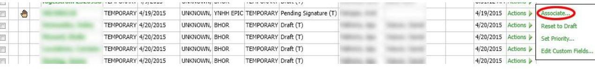

CONTAINS:

1. CIT REPORT RESOLUTION
2. EPIC DOWNTIME RADIOLOGY REPORTS RECONCILIATION FORM
3. BCA QUICK REFERENCE GUIDE
4. ADMINISTRATIVE POLICIES AND PROCEDURES: EPIC DOWNTIME

PROCEDURE IN DIAGNOSTIC RADIOLOGY

# CIT Downtime Report Resolution Procedure 

REVISED 1/17/2020
AVITABLE, JOHN

# Downtime Report Resolution Procedure 

The purpose of this document is to set the expectation for what the Clinical Imaging Technology team's responsibilities are in the event of a planned Epic downtime resulting in temporary accessions being generated.

## Preliminary Tasks

1. Determine relevant staff that will be working during Downtime.
a. Go to amion.com to find YSC and SRC on-call Resident and Radiologist.
I. Attending Schedule: can be found on yalerad.qgenda.com
b. Eileana Valentin Eileana.Valentin@bpthosp.org is the contact for BH residency at this time
c. GH uses Nighthawk Telerad service for overnight ED exams which are faxed in and are thus unaffected by an Epic downtime.
2. Email the relevant staff to remind them of the downtime. You may wish to include a phone number that you can be reached at if any issues are encountered.

## 2:00AM - Downtime Begins

Orders for imaging exams will be written on paper. These paper orders will have a sticker placed on them with the Downtime/Temporary Accession number. When performing these exams, technologists will track the exams that they perform on a log sheet. The information on this log sheet should include: Patient Name, MRN, Exam Type, Exam Date and Time, Temporary Accession, Epic Accession

While the techs are performing exams and recording information on the logs, Radiologists are dictating in PowerScribe on temporary accessions. Radiologists may include additional information in their report such as Patient Name and MRN, though they are not required to do so.

## 6:00AM - Downtime Ends

After the downtime ends, you will receive notification from Production Control that the downtime activities have been completed successfully. Once the Production system comes back up, the Technologists will begin placing, scheduling, and completing the orders that were placed on paper during the downtime.

Once all orders are placed, and their Epic accession numbers noted, the aforementioned log will be sent to DITraining@ynhh.org along with contact information for the individual who sent in the log.

## Associating Temporary Accessions with Epic Accessions

Once you receive logs, you can begin associating temporary accessions with Epic accessions. No temporary accession will be associated without proper documentation. You should not have to do any research or make any judgment calls to determine whether or where a temporary accession should be associated. If there are any questions, you should contact the person who sent the log.

To associate Temporary Accessions, login to the PowerScribe webportal and search for all temporary accessions created in the past 24 hours.

| Site |  | Order Status |  | Patient Class |  | Account |  |  |
| :--: | :--: | :--: | :--: | :--: | :--: | :--: | :--: | :--: |
| All | $\checkmark$ | Temporary | $\checkmark$ | All | $\checkmark$ | All | $\checkmark$ |  |
| Locking |  | Report Status |  | Section |  | Ordering Physician |  |  |
| All | $\checkmark$ | All | $\checkmark$ |  | $\checkmark$ | All |  |  |
| Time Frame | Custown | Transfer Status |  | Location |  |  |  |  |
| Past 2 days | $\checkmark$ | All | $\checkmark$ |  | $\checkmark$ |  | Reset | Search 4 |

A list of search results will appear which should include all of the temporary accessions that were created during the downtime, as well as potentially other accessions that do not need to be addressed. You will only be associating temporary accessions that have been appropriately documented on the log. Different sites will usually put a prefix on their temporary accession numbers that will denote the location that they came from. Accessions that contain a patient's name should be disregarded.

From the search results screen, you will have an Actions link all the way to the right of the screen. From here, you can select the Associate option. After clicking Associate, you will have the option to add or replace the order. You should select the Replace option. Once selecting the appropriate option, you can search for the Epic accession number and complete the association. Once completing the association, the system will wait 3 minutes and send the report to Epic. Alternatively, you can force the report to send now.

After sending the report to Epic, you should confirm that it appears appropriately and made it through the interface. There can potentially be issues with interfaces both on the Epic and PowerScribe sides, especially surrounding a downtime.

# 7:00AM - Status Report 

At 7:00AM, you should have begun receiving downtime logs. Send a status report including information about who has sent in logs, at what time, and what you are still waiting for. This email should be sent to:

YDR Administrators
YDR Section Chiefs
YSC ED Overnight Staff
YNHH Radiology Management
BH Radiology Management
Matthew Zawalich and Heather Hogle

## Follow-Up Status Report

After sending the initial status report and continuing to associate temporary accessions as they come in, you should send out another email updating key staff on the progress being made. This email does not need to include the radiologists (YDR Section Cheiefs), generally only management needs to receive this email.

In this email, you can reference what isn't going appropriately, where and what information you are having a hard time obtaining, as well as what is going appropriately. If there is a particular location that provided their logs in a timely manner, you can give a shout out to the person who provided this information.

# Final Status Report 

Once all of the temporary accessions have been associated with the appropriate Epic accessions, you can send out a final summary email to everyone and include the radiologists (YDR Section Chiefs) as well. Let them know that all of the temporary accessions have been appropriately associated and verified in Epic and you can once again give a shout out to those who performed extremely well.

## Deleting Temporary Accessions

The final task that needs to be completed at the end of report resolution is deleting the temporary accessions that have been associated. This is not a high priority task and can be completed after everything else.

## Contacts for Missing Information

In the event that you are not receiving the information that you need, below are persons that can be contacted.

| YSC | SRC | BH |
| :--: | :--: | :--: |
| 1. ED Reading Room 6886180 | 1. ED Techs - 7895909 | 1. Resident On-Call (Lounge) - 203-3844368 |
| 2. Neuro Reading Room 200-3181 | 2. CT Techs - 789-3959 | 2. Resident On-Call Pager accessible from SmartWeb |
| 3. ED Front Desk 688-2355 | 3. ED Reading Room - 789-3013 | 3. Reading Room - 203-384-2884 |
| 4. Manager on Call Contact ED Front Desk | 4. Manager on Call Contact YSC ED Front Desk | 4. Techs - 203-384-3177   5. Tech On-Call Pager accessible from SmartWeb |
|  |  | 6. Manager on Call :   Leah Velardi (203) 903-   3448 |

## Email Distribution Lists

The below distribution lists are attached to this document as Outlook Items. You can save the attached files to your desktop and drag them into the "People" section of Outlook 2013 to add them to your address book.
YDR Admin

| Rob Goodman | Rob.goodman@yale.edu |
| :-- | :-- |
| Serena |  |
| DelBasso | serena.delbassso@yale.edu |

| Body Imaging | Gary Israel | gary.israel@yale.edu |
| :--: | :--: | :--: |
| Breast Imaging | John Lewin | john.lewin@yale.edu |
| Cardiac Imaging | Hamid Mojibian | hamid.mojibian@yale.edu |
| Emergency Radiology | Jason |  |
|  | Teitelbaum | jason.teitelbaum@yale.edu |
| Interventional Radiology | David Madoff | david.madoff@yale.edu |
| Musculoskeletal | Andrew Haims |  |
| Radiology |  | andrew.haism@yale.edu |
| Neuroradiology | Amit Mahajan | Amit.mahajan@yale.edu |
| Nuclear Medicine | Lawrence |  |
|  | Saperstein | Lawrence.spaerstein!yale.edu |
| Pediatric Radiology | Cicero Silva | cicero.silva@yale.edu |
| Thoracic Imaging | Anna Bader | anna.bader@yale.edu |
| Ultrasound | Jonathan Kirsch | jonathan.kirsch@yale.edu |

# Managers Radiology YSC/SRC 

| Hamid Mojibian, | Hamid.mojibian@yale.edu |
| :-- | :-- |
| BH Radiology Admin |  |
| Adel Mustafa, Manager, | adel.mustafa@ynhh.org |
| Physics |  |
| Judy Pasqualoni, | judy.pasqualoni@ynhh.org |
| Manager, Marketing |  |
| Robert DeVito, Sr. | robert.devito@ynhh.org |
| Manager, XRay |  |
| Anne Marie Watrous, | annemarie.watrous@ynhh.org |
| Manager, SRC XRay |  |
| Dave Facchini, Manager, | david.facchini@ynhh.org |
| Q\&S/XRay |  |
| Beth DeRosa-Linsley, Sr. | elizabeth.derosa- |
| Manager, US | linsley@ynhh.org |
| Kim Hall, Manager, | kim.hall@ynhh.org |
| Business Services/Clerical |  |
| Sue Mastriano, Business | sue.mastriano@ynhh.org |
| Manager |  |
| Landra Knoth, Access | landra.knoth@ynhh.org |
| Manager |  |

