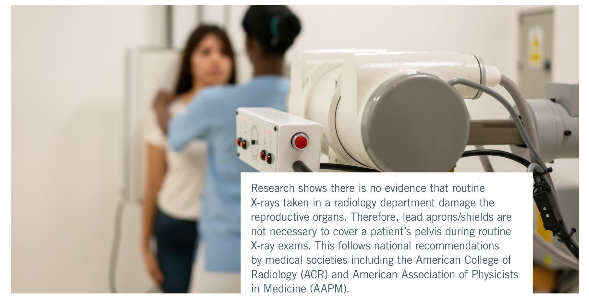

# Lead aprons no longer needed for patients during X-ray exams Yale New Haven Health adapts new practice 

Yale New Haven Health (YNHHS) is confident that this new practice is safe for patients and has adapted the new practice. At YNHHS facilities, lead aprons are no longer used on patients undergoing routine X-rays. The X-ray technologists at these facilities always follow the ALARA principle (As Low As Reasonably Achievable). This means they will use the lowest amount of radiation to produce quality images.

If you have any questions, feel free to speak to your X-ray technologist.