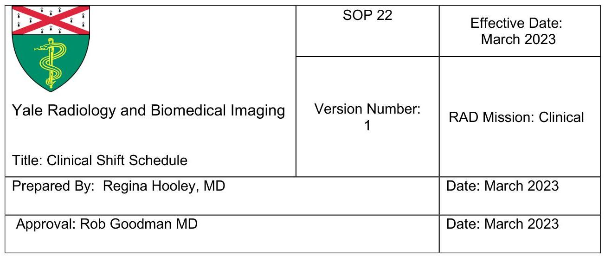

# A. Purpose 

The purpose of this Standard Operating Procedure (SOP) is to describe the Department of Radiology's process for clinical shift scheduling and provide guidance for faculty who may sign up for two shifts within a single 24 -hour period. Prolonged and overlapping shifts, as well as extended double shifts, may lead to increased stress, fatigue, and lack of concentration. These effects may, in turn, impact patient safety with data within and outside of medicine showing higher rates of unintentional error. It is the goal of the department to allow adequate gaps between assigned clinical shifts to ensure faculty are given an adequate period to rest/recover.

## B. Scope

1. The SOP applies to all YDR clinical shifts, exclusive of emergent afterhours work done during a call shift.

## C. Procedures

1. Double shifts
a. Faculty should not be assigned or sign up for more than 2 shifts in a 24 -hour period and should not work more than 15 hours in a 24 -hour window.
i. Evening and overnight shifts require an 8 -hour gap between shifts. Rare exceptions may be made under special circumstances, with the approval of the Chair's office and the relevant division/section chief.
ii. A shift represents a day, evening, or overnight session. As such, faculty should not take more than 2 shifts in one working day. Rare exceptions may be made under special circumstances, with the approval of the Chair's office and the relevant division/section chief.
2. Overlapping/Synchronous Shifts
a. No faculty should be scheduled for synchronous shifts. If this does take place, only 1 shift credit will be applied.
b. Consecutive shifts can take place, with the following caveats:
i. Overlapping shifts will receive credit prorated to the overlapping shift hours.
ii. Untimed shifts will count as a full 9-hour shift during the day it is assigned in Qgenda.

D. References and Review

Reviewed by Drs. Goodman, Pahade, Forman and Hooley, plus the YDR Clinical Affairs Team
E. Revision History

| Version | Date | Reason For Revision |
| :-- | :-- | :-- |
|  |  |  |