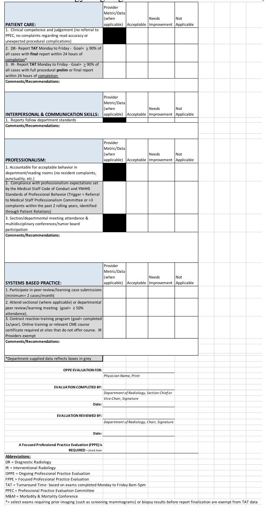

| Yale Radiology and Biomedical Imaging | SOP 11 | Effective Date:   Sept 2022 |
| :-- | :-- | :-- |
| Title: Yale Radiology OPPE | Version Number:   3 | RAD Mission: Clinical |
| Prepared By: Jay Pahade, MD | Date: Sept 2022 |  |
| Management Approval: Rob Goodman, MD | Date: Sept 2022 |  |

1.0 Purpose:

The purpose of this Standard Operating Procedure (SOP) is to describe the policy and provide guidance for Ongoing Professional Practice Evaluation (OPPE) within YDR.
2.0 Scope:

This SOP applies to all radiologists and licensed independent practitioners employed by YDR with medical staff privileges.

# 3.0 Materials: 

Appendix 1 - Yale New Haven Health System (YNHHS), Radiology OPPE Form

### 4.0 Procedures:

4.1 The Joint Commission (TJC) requires "Ongoing Professional Practice Evaluation" (OPPE) forms to be completed for all medical providers at the frequency of about every nine months, but not to exceed greater than every 12 months. Per the TJC, an OPPE identifies professional practice trends that may impact the quality and safety of care and applies to all practitioners granted privileges via the Medical Staff chapter requirements. A well-designed process supports early detection and response to performance issues that could negatively impact patient outcomes.
4.2 For Yale Radiology, we have modeled our OPPE to use similar categories as used by the ACGME core competency model encompassing: (1.) Patient Care, (2.) Interpersonal \& Communication Skills, (3.) Professionalism, and (4.) SystemsBased Practice (See Appendix 1 for YNHHS Radiology OPPE Form).
4.3 The Departmental Program Manager is responsible for generating OPPE forms for review by the Vice Chair Quality of Safety, Vice Chair Clinical Affairs and/or Section Chief for review and approval, and then final submission to Departmental Chairman for review.
4.4 Forms will be prepared with pre-populated provider/metric data by departmental administration where applicable. An " $X$ " will be placed within the appropriate column of 'Acceptable', 'Needs Improvement', or 'Not Applicable' for remaining metrics by designee assessing the practicing radiologist/LIP.

There are four qualitative assessments on the form within each of the categories, where Division/Section chiefs can provide comments/recommendations for providers who receive 'Needs Improvement' designation.
4.5 Metrics scored as "Needs Improvement" may identify performance issues that could negatively affect patient care. An OPPE is a broad screening tool and it is recognized that many providers who do not meet acceptable or threshold goals for assessed categories will not be deemed as an outlier after further investigation. A "Focused Professional Practice Evaluation" (FPPE) may need to be conducted based on review of the OPPE form if the provider is felt to be an outlier for what the department deems acceptable standard of care. Final decision to consider a FPPE will be made by Chairman upon review of overall physician performance.
4.6 If physicians were not in the Department for part or all of the identified dates for OPPE, their data will either be pro-rated or labeled Not Applicable (N/A).
5.0 Definitions/Abbreviations:

SOP: Standard Operating Procedure
YNHHS: Yale New Haven Health System
OPPE: Ongoing Professional Practice Evaluation
YDR: Yale Department of Radiology \& Biomedical Imaging
TJC: The Joint Commission
N/A: Not Applicable
FPPE: Focused Professional Practice Evaluation
LIP: Licensed Independent Practitioner
6.0 References:

https://www.jointcommission.org/standards/standard-faqs/critical-access-hospital/medical-staff-ms/000001500/
7.0 Revision History:

| Version | Date | Reason For Revision |
| :-- | :-- | :-- |
| 1.0 | $05 / 18 / 21$ | Create OPPE SOP |
| 1.0 | $02 / 22 / 2022$ | Reviewed by JPahade and no updates required |

YNHHS Radiology Ongoing Professional Practice Evaluation (OPPE) Form
