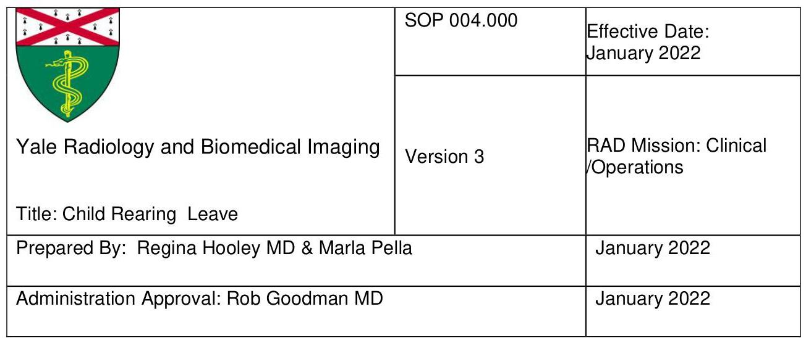

A. Purpose

The purpose of this Standard Operating Procedure (SOP) is to describe the YDR/YSM faculty child rearing leave benefit, which provides faculty protected time with a newborn or newly adopted child under the age of six without any penalty with regards to employment.
B. Scope

The SOP applies to full-time clinical and research faculty. Part-time faculty who are working at least half-time ( $50 \%$ or more work effort) will receive similar benefits.

# C. Procedures: 

1. Effective January 1, 2022, faulty working in the state of CT are eligible to apply for Paid Family and Medical Leave (PFML) benefits through the State of Connecticut Paid Leave Authority. Under the PFML, faculty are eligible for up to 12 weeks of paid child rearing leave in a 12 -month period.
2. Faculty may extend leave beyond 12 weeks by using PTO and/or unpaid leave. The total leave should not exceed 6 months, including the initial 12 weeks. The leave does not need to be continuous.
3. There is an option for an additional 8 weeks part-time status with pay commensurate with part-time work effort.
4. If both parents are eligible faculty members, each are independently entitled to the paid child rearing leave.

## 4. Extension of Appointment

As per YSM guidelines, any full-time faculty member who takes paid and/or unpaid child rearing leave may request a one-year extension of his/her appointment.

## 5. Application

As soon as possible (and before commencement of leave), faculty should complete the child rearing leave request form and submit the completed form to Marla Pelle, Associate Director for Academic Affairs (marla.pelle@yale.edu) Additionally, faculty should complete the CT PFML application at https://ctpaidleave.org/s/employee-landing-

page?language=en US. Yale will coordinate with the State of Connecticut to provide any supporting documentation requested. Any changes should be reported to Marla Pelle and one's Division/Section Chief as soon as possible

# 6. Limitations 

No departmental clinical work may be undertaken during the leave period.

## 7. Clinical target

Child rearing leave will reduce clinical faculty member's clinical workday target. Faculty who work over their reduced target before or after the leave period will be eligible for standard y-payments.
8. References/Review
https://medicine.yale.edu/oapd/academicaffairs/leaves/leaves/?tab=Child+Rearing https://medicine.yale.edu/oapd/academicaffairs/leaves/Child\ Rearing\ Leave\ Request \%20Form\%20\%28February\%202022\%29\%5B1\%5D_407229_284_47834_v3.pdf
Reviewed by Marla Pella, YDR Academic/Administrative Affairs
9. Revision History

| Version | Date | Reason For Revision |
| :-- | :-- | :-- |
| 2 | $10 / 22 / 18$ | Updated as per new YSM policy |
| 3 | $01 / 17 / 2022$ | Updated as per CT FMLA |