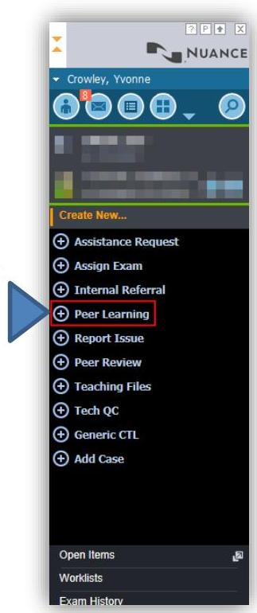
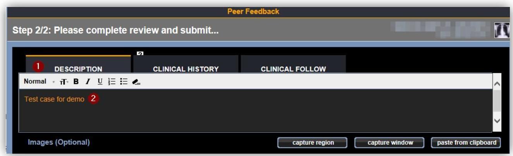
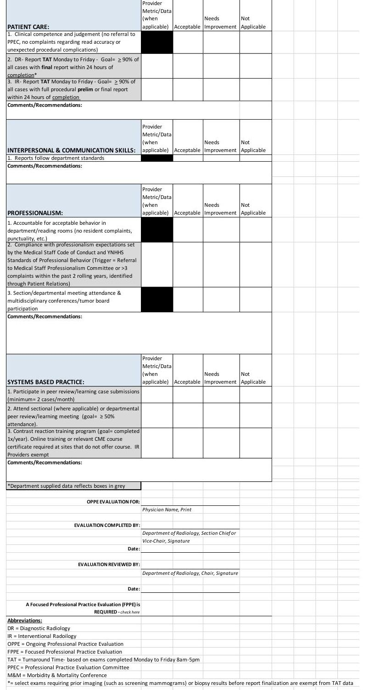

| Yale Radiology and Biomedical Imaging | SOP 800.000 | Effective Date:   8/1/20 |
| :-- | :-- | :-- |
|  | Version Number:   1 | RAD Mission: Clinical |
|  |  | Date: 2/25/2022 |
| Prepared By: Jay Pahade MD |  | Date: 2/25/2022 |
| Management Approval: Rob Goodman MD |  |  |

# Purpose 

Peer learning supports a culture of learning and minimizing blame. Guiding principles are:

- All radiologists are encouraged to submit peer feedback.
- Feedback is identified by peers and brought back to individual radiologists by a peer learning leader in a respectful fashion to improve their practice.
- Peer learning opportunities are presented to sections and/or the whole department in an anonymous way by the section chief or designee in a non-judgmental fashion focused on group learning and clinical improvement.

Goal: The goal of peer learning is improvement of services. That goal relies on the establishment of trust, and the free exchange of feedback in a constructive and professional manner. Constructive feedback on the quality of daily work as radiologists is paramount for keeping patients safe, reducing the risk of litigation, and creating an environment of learning.

Definition of Peer Learning opportunities: Peer learning cases address actual or potential performance issues, including both discrepancies and "great calls." Cases are identified during routine work, case conferences, event reports, or by other sources.

## Description of program structure and organization:

a. Roles and responsibilities:
a. Peer Learning Program Leaders:

i. Director of Peer Learning: The responsible radiologist or other leader responsible overall for the peer learning program. This is currently led by the Vice Chair for Quality and Safety.

1. Promote the peer learning program to all radiologists
2. Develop and maintain peer learning workflows
3. Train radiologists in expectations and process for submitting learning opportunities
4. Oversee peer learning programming, identifying and implementing best practices
5. Support the translation of learning opportunity submissions into quality improvement
6. Coordinate whole-department peer learning conferences focused on systems issues and improvements
7. Review peer learning annual report
ii. Subspecialty Peer Learning Program Managers (in our department these are the section delegated leads)
8. Receive and review learning opportunity submissions
9. When appropriate, discuss learning opportunities with individual radiologists
10. Coordinate and develop content for subspecialty peer learning conferences
11. Work with Vice Chair of Quality and Safety to translate learning opportunity submissions into quality improvement.

# b. Radiologists 

i. Interpret exams with an awareness of possible learning or improvement opportunities
ii. Submit learning opportunities when identified during routine exam interpretation or when otherwise encountered
iii. Engage in peer learning conferences

# c. Administrative Support: 

i. Main responsibility is to support radiology experts and run the logistics of the program

1. Scheduling of peer learning conferences
2. Create and maintain records of the peer learning conference, including attendance lists and learning opportunity summaries
3. Work with CME coordinator to obtain CME approval for conferences.
4. Assist in annual report creation and OPPE peer learning case submission data.
5. Assist in data and slide curation for departmental peer learning conference
6. Assist in post conference report out of learning opportunity cases to hospital PPEC (professional practice executive committee).

The process and requirements for active participation in the YDR peer review/peer learning program.

## Scope

This policy affects all attending clinical radiologists.

## Materials

Appendix 1- Primordial Peer Learning Case Submission TIPS Sheet
Appendix 2- Yale New Health System Radiology OPPE form

## Workflow/Participation:

Meaningful participation in the department peer learning program is defined by two (2) components.
1- Active participation in case entry. For all full or part time Radiologists (except IR practitioners), active participation is defined as at least 24 case entries (average 2 case per month) into the peer learning software per academic year (July $1^{\text {st }}$ - June $30^{\text {th }}$ ). This will satisfy one of the requirements for YNHHS Radiology OPPE (Appendix 2). Cases submitted as a "learning opportunity" or "good calls" will both count towards meaningful participation. See Appendix 1 for instructions on case entry. Either the sectional peer learning champion or departmental peer learning program coordinator (currently Vice Chair of Quality and Safety) can deem a case as non-meaningful if the case is deemed to offer no learning value. Those cases will not count towards departmental quota for case participation and can be deleted. Participation will be pro-

rated for any leaves of absence (medical leave, maternity/paternity, sabbatical, etc). IR practitioners do not have minimum case submission requirements for presentation at the IR M and M / Peer learning conference.
2- At least $50 \%$ attendance in the YDR department wide quarterly peer learning conference (known as IRIS) for staff members primarily affiliated with divisions of neuroradiology, cardiothoracic radiology, emergency radiology, body radiology, musculoskeletal radiology, and pediatric radiology. At least $50 \%$ participation in dept. wide peer learning conference OR sectional peer learning/ Morbidity and Mortality conference will constitute active participation for staff members in division of nuclear medicine, breast radiology and interventional radiology as these divisions do not currently present cases at IRIS dept wide peer learning conference. This will satisfy one of the requirements for YNHHS Radiology OPPE (Appendix 2). Sectional meetings should be held at least once per quarter but can be held more frequently at discretion of section chief/sectional peer learning champion. Radiologists can watch the recorded conference if unable to watch real time by contacting the YDR IT team and should notify Andrea Duarte after that is completed to update attendance records.

# Reporting: 

The peer learning program is committed to sequestering peer learning activity content from individual practitioner's performance evaluation. Participation in the peer learning program will be included in the OPPE evaluation for Radiologists, but performance data will not be created out of peer learning data.

The Vice Chair of Quality and Safety makes the following documents available to the hospital's Professional Practice and Evaluation Committee (PPEC) each quarter as required under the YNHH Peer Review umbrella.

- Records of the peer learning conferences, including attendance lists, radiologist involved in case, teaching points and potential action plans from cases deemed potential learning opportunities.

Quality Improvement: Our aim is to translate findings from peer learning activities into dedicated quality improvement efforts. This involves coordination between Vice Chair of Quality and Safety, who also oversees departmental Quality Improvement projects, with the support of a YNHH Radiology QI team.

Annual Report: Annual Peer Learning program accomplishments can be obtained from peer learning database. This includes
(1) Total number of exams submitted as peer learning opportunities or Great Calls
(2) Number and percent of radiologists meeting the peer learning attendance requirement (part of YDR OPPE)

(3) Number and percent of radiologists meeting the submission requirement (part of YDR OPPE)
(4) List of quality improvement activities tied to issues brought up in peer learning submissions and discussions.

# Definitions/Abbreviations 

SOP: Standard Operating Procedure
YDR: Yale Department of Radiology and Biomedical Imaging
PPEC/: Professional Practice Evaulation Committee
IRIS: Improved Radiology Interpretation System
OPPE: Ongoing professional Practice Evaluation

## References

S. DelBasso, R. Hooley, TR Goodman

## Revision History

| Version | Date | Reason For Revision |
| :-- | :-- | :-- |
| 1.0 | $6 / 11 / 20$ | New SOP creation |
| 2.0 | $2 / 25 / 22$ | Updates |

Appendix 1

# Primordial - Peer Learning Case Entry 

The new way to submit Peer Learning cases within Primordial for Radiologists. Requirement is still 2 cases/month for DIAGNOSTIC Radiologists (IR runs their own M and M ).

1. Launch a study via Primordial for viewing on a work-station with Visage. You will now use the Primordial Communicator App to access the Peer Learning Software. Our old software called Peervue (the orange eye ball icon) will be removed soon.
2. In the Communicator the Create New list should be accessible. Click Peer Learning. Note, many of the other options you see here like Tech QC and Peer Review are not active/not relevant right now. The Report Issue can be used to launch the IT help form.

3. After selecting Peer

Learning, the software will launch and the Step 1 box will open.
a. First thing you do is choose the case you are assigning the Peer Learning Comments to. Most of the time this will be a prior exam, not the one you are reading currently. Please pick the correct study.
b. Next you can change the
"Identified By" option on the upper right from radiologist to outside physician or risk management if relevant. This allows us to know how the case entry came about. Most of the time it can stay defaulted to Radiologist as most cases are identified by a radiologist for another radiologist.
c. Next choose the section the case belongs to. This should be picked based on which section the radiologist who read the case belongs to NOT which section YOU belong to. I have also created a division called "Other" which can be used when entering a case that was read by a non-Yale radiologist like L\&M, Bridgeport Hospital etc. The "Community" option can be used for cases read by RCPC/Temple Radiology who don't belong to subspecialty divisions.
4. Click Next

5. The Step 2 box will open. Under the Description tab, enter in your comments for that

case.
You need to enter some text in this box, even for Good Call cases. The Clinical History and Clinical Follow are optional tabs and do not need to be filled out unless you want to add that information in.
a. Note: Capture Region, Capture Window, Paste from clipboard will be new features that will allow screenshots to be included in the Peer Learning Entry. This option is not available yet but will be available soon. It will allow you to capture the most relevant images that pertain to the case.
6. Last click one of the three options at the bottom of the page:
a. Learning opportunity:

Feedback for a case where a potential learning opportunity exists for the radiologist who read the case. This will count towards our dept. requirement of entering 2 cases/month as meaningful participation in our peer learning program.
b. Good Call: Feedback on a nice call made by a colleague. This will count towards our dept. requirement of entering 2 cases/month as meaningful participation in our peer learning program.
c. For Discussion: Will flag the case for potential discussion in a sectional conference. Each section can use this as they like. You can use it to flag rare pathology, technical/artifact issues, protocol concerns, etc. These cases DO NOT count towards your requirements for participation but are a good way to keep track of cases you want to review with your sectional colleagues.

That's it! The case will now be sent to the sectional Peer Learning Champion and/or Section Chief for further processing and review. Each sectional champion has authority to either send the case onto the radiologist who read the study or not. Any case that offers an opportunity to learn and improve our skills as a radiologist will be sent through. The

interpreting radiologist will get an email with the case information and case comments. If the case is felt to offer little or no value, no email will be sent.

# Appendix 2- YNHHS Radiology Ongoing Professional Practice Evaluation (OPPE) Form 

